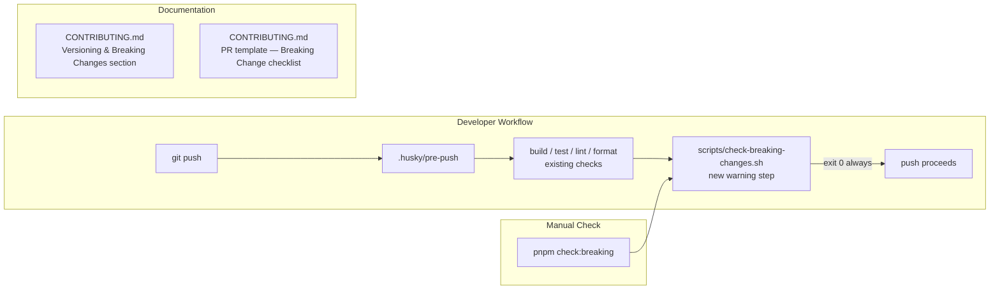

# Design Document: SDK Breaking Change Policy

## Overview

This feature formalizes the versioning and breaking-change policy for all `@ancore/*` packages. It has no runtime component — the deliverables are documentation changes, a shell script, and a hook update. The goal is to make breaking changes visible and deliberate: contributors learn the policy from `CONTRIBUTING.md`, the pre-push hook warns them when their commits contain breaking changes, and the PR template ensures reviewers can confirm versioning decisions before merge.

The existing release workflow (`release.yml`) already handles the `prerelease` flag for tags containing `rc`, so no CI changes are required. The design focuses on the four concrete artifacts: the `CONTRIBUTING.md` additions, `scripts/check-breaking-changes.sh`, the `.husky/pre-push` update, and the `package.json` script registration.

## Architecture

The feature is purely tooling/documentation — there is no application code. The components interact as follows:



Key design decisions:

- **Exit 0 always**: The script is a warning, not a gate. Blocking pushes would create friction for legitimate workflows (e.g. pushing a breaking change branch for review). The PR checklist is the enforcement point.
- **No new dependencies**: The script uses only POSIX shell and `git log`. No Node.js, no npm packages.
- **Push-range scoping**: The script reads the range from Git's pre-push stdin/args so it only scans commits in the current push, not the entire history.

## Components and Interfaces

### 1. `scripts/check-breaking-changes.sh`

A POSIX-compatible shell script. Git's pre-push hook passes push information via stdin in the format:

```
<local-ref> <local-sha1> <remote-ref> <remote-sha1>
```

The script reads this from stdin (as Git delivers it), determines the commit range, runs `git log` with `--format="%H %s"` over that range, and greps for `BREAKING CHANGE:` in the full commit message or `!` in the type/scope portion of the subject line.

**Interface:**

```
Usage: check-breaking-changes.sh
  Reads push range from stdin (Git pre-push format).
  When run manually (no stdin), falls back to HEAD vs upstream tracking branch.

Exit codes:
  0  always (warning only)

Output:
  Nothing if no breaking changes found.
  Warning block to stderr if breaking changes found, listing commit hash + subject.
```

**Null SHA handling:** When `<remote-sha1>` is `0000000000000000000000000000000000000000` (new branch with no remote counterpart), the script uses `<local-sha1>` as the tip and scans all commits not reachable from any remote ref (`git log <local-sha1> --not --remotes`).

### 2. `.husky/pre-push` update

Append the Warning_Script invocation after the existing format check:

```sh
echo "🔍 Checking for breaking changes..."
bash scripts/check-breaking-changes.sh
echo "✅ Breaking change check complete!"
```

The script always exits 0, so the hook chain is never interrupted.

### 3. `package.json` — `check:breaking` script

```json
"check:breaking": "bash scripts/check-breaking-changes.sh"
```

When run outside a push context (no stdin from Git), the script detects the absence of stdin data and falls back to comparing `HEAD` against `@{upstream}`.

### 4. `CONTRIBUTING.md` additions

Two sections are added/updated:

- **New section**: "Versioning & Breaking Changes" — inserted after the existing "Development Workflow" section. Contains: semver policy table, breaking change examples (footer token + `!` shorthand, correct vs incorrect form), RC process steps, and the `pnpm check:breaking` command.
- **Updated section**: "Pull Request Template" — a new "Breaking Change" checklist group is added to the existing template block.

## Data Models

This feature has no data models. The only structured data is the commit message format defined by Conventional Commits 1.0.0:

```
<type>[optional scope][optional !]: <description>
[optional body]

[optional footer(s)]
BREAKING CHANGE: <description>
```

The script pattern-matches against this format using two grep patterns:

| Pattern | Matches |
|---|---|
| `BREAKING CHANGE:` | Footer token in commit body |
| `^[a-z]\+[^:]*!:` | `!` shorthand in type/scope |

## Correctness Properties

*A property is a characteristic or behavior that should hold true across all valid executions of a system — essentially, a formal statement about what the system should do. Properties serve as the bridge between human-readable specifications and machine-verifiable correctness guarantees.*

### Property 1: Breaking change commits produce a warning with hash and subject

*For any* push range containing one or more commits whose messages include `BREAKING CHANGE:` in the body/footer or a `!` type marker in the subject, running `check-breaking-changes.sh` should exit with code 0 and print output that includes each offending commit's hash and subject line.

**Validates: Requirements 4.2, 4.3**

### Property 2: Clean commits produce no output

*For any* push range where no commit message contains `BREAKING CHANGE:` or a `!` type marker, running `check-breaking-changes.sh` should produce no output and exit with code 0.

**Validates: Requirements 4.4**

### Property 3: Null-SHA new-branch scan

*For any* local SHA1 paired with the null remote SHA (`000...000`), running `check-breaking-changes.sh` should scan all commits reachable from the local SHA1 that are not yet present on any remote ref, and apply the same breaking-change detection logic.

**Validates: Requirements 4.6** *(edge case — covered by the generator in Property 1)*

## Error Handling

| Scenario | Behaviour |
|---|---|
| `git log` fails (not a git repo, detached HEAD with no commits) | Script prints a warning to stderr and exits 0 — never blocks the push |
| No upstream tracking branch when run manually | Script prints a notice that no upstream is configured and exits 0 |
| stdin is empty / not a terminal and no upstream | Script scans no commits, produces no output, exits 0 |
| `scripts/check-breaking-changes.sh` is not executable | `bash scripts/check-breaking-changes.sh` invocation in the hook bypasses the executable bit requirement |

The script must never exit non-zero. All error paths fall through to a clean exit.

## Testing Strategy

### Dual Testing Approach

Both unit/example tests and property-based tests are used. Unit tests cover specific documented examples and structural checks (file content, script registration). Property tests cover the script's behavioral guarantees across arbitrary commit histories.

### Unit / Example Tests

These verify the static artifacts:

- `CONTRIBUTING.md` contains the "Versioning & Breaking Changes" section heading
- `CONTRIBUTING.md` contains at least two `BREAKING CHANGE:` footer examples
- `CONTRIBUTING.md` contains at least one `!` shorthand example
- `CONTRIBUTING.md` contains the correct/incorrect blank-line counter-example
- `CONTRIBUTING.md` contains the RC naming convention `vX.Y.Z-rc.N`
- `CONTRIBUTING.md` contains the `next` dist-tag instruction
- `CONTRIBUTING.md` contains the `pnpm check:breaking` command reference
- `CONTRIBUTING.md` PR template contains the "Breaking Change" checklist group with three items
- `package.json` `scripts.check:breaking` key exists and references `check-breaking-changes.sh`
- `.husky/pre-push` invokes `check-breaking-changes.sh` after the format check line
- `release.yml` `prerelease` condition contains `contains(github.ref, 'rc')`

### Property-Based Tests

Property tests run the actual shell script against synthetic git repositories created in a temp directory. The recommended library is [fast-check](https://fast-check.dev/) (already available in the Node ecosystem; no new dependency needed beyond a test runner).

**Property test configuration**: minimum 100 iterations per property.

**Property 1 test** — `Feature: sdk-breaking-change-policy, Property 1: Breaking change commits produce a warning with hash and subject`

```
// For any list of commits where at least one contains BREAKING CHANGE: or !,
// the script exits 0 and stdout/stderr contains each breaking commit's hash and subject.
```

Generator: produce an array of commit message strings; at least one is randomly chosen to be a breaking change (either footer or `!` form). Create a real git repo in a temp dir, make those commits, run the script with the appropriate push range, assert exit code === 0 and output contains each breaking commit's abbreviated hash and subject.

Edge cases included in the generator:
- Null SHA (new branch) — remote SHA set to `0000000000000000000000000000000000000000`
- Mixed breaking and non-breaking commits in the same push range
- `!` in scope: `feat(core-sdk)!: remove deprecated method`
- `BREAKING CHANGE:` with no blank line (malformed — script should still detect the token)

**Property 2 test** — `Feature: sdk-breaking-change-policy, Property 2: Clean commits produce no output`

```
// For any list of commits with no breaking change markers,
// the script produces no output and exits 0.
```

Generator: produce an array of conventional commit messages with no `BREAKING CHANGE:` and no `!` marker. Create a git repo, make those commits, run the script, assert exit code === 0 and output is empty.

### Test File Location

```
scripts/__tests__/check-breaking-changes.test.ts
```

Uses `vitest` (already present in the repo) with `fast-check` for property generation and Node's `child_process.execSync` / `spawnSync` to invoke the shell script.
