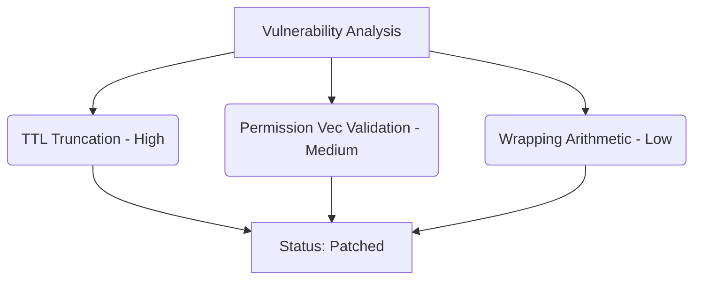

# Internal Security Audit Report: Account Contract (v0)

**Date**: June 24, 2026  
**Auditor**: Internal Review Team  
**Scope**: `contracts/account/src/lib.rs` (`execute()`, `add_session_key()`, nonce validation, and storage TTLs)  
**Status**: Completed & Patched  

---

## Executive Summary

An internal security review was conducted on the core smart account contract (`AncoreAccount`) to identify potential vulnerabilities, logic errors, and compliance with secure smart contract design patterns prior to external audit engagement. 

The review focused on three primary security surfaces:
1. **`execute()`**: Nonce monotonicity, permissions enforcement, and sub-call isolation.
2. **`add_session_key()`**: Expiration checks, duplicate keys, and permission vector validation.
3. **Storage & Arithmetic**: Integer overflow/underflow checks and storage TTL expiration safety.

A total of three findings were identified and patched. All unit tests have been updated and run successfully.

---

## Detailed Findings



### 1. [High] Integer Truncation in Session Key TTL Extension

#### Description
In the helper function `extend_session_key_ttl()`, the requested session key TTL was calculated as:
```rust
let ledgers_to_live = if expires_at_secs > current_timestamp {
    ((expires_at_secs - current_timestamp) / 4) as u32 + DAY_IN_LEDGERS
}
```
If a client registered a session key with a very large expiration timestamp (e.g., `u64::MAX` or far in the future), the division `(expires_at_secs - current_timestamp) / 4` would produce a value larger than `u32::MAX`. Casting this to a `u32` using `as u32` causes an integer truncation (wrapping).

#### Impact
This wrapping could result in `ledgers_to_live` becoming extremely small, causing the session key persistent storage entry to expire much earlier than requested. Consequently, valid session keys would be prematurely evicted from the ledger, causing transaction execution to fail with `SessionKeyNotFound` (Denial of Service).

#### Resolution
Refactored the TTL extension function to use safe saturating arithmetic and checked casting:
```rust
let ledgers_to_live = if expires_at_secs > current_timestamp {
    let diff_seconds = expires_at_secs.saturating_sub(current_timestamp);
    let calculated_ledgers = (diff_seconds / 4)
        .try_into()
        .unwrap_or(u32::MAX);
    calculated_ledgers.saturating_add(DAY_IN_LEDGERS)
}
```

---

### 2. [Medium] Lacking Validation for Permission Vectors in Session Keys

#### Description
The `add_session_key()` function allowed the registration of session keys with arbitrary, unknown permission values (e.g. values greater than `2`) and duplicate values in the `permissions` vector. Although the execution path checks for the presence of `PERMISSION_EXECUTE` (`1`), accepting unvalidated permission values could result in:
- Wasted ledger storage space due to bloating of the persistent session key structure.
- Future permission collision issues when new permission bits are introduced.

#### Impact
Medium. An attacker or buggy dApp could register session keys containing arbitrary values or duplicates, increasing transaction fees and bloating contract state storage.

#### Resolution
Added a validation loop in `add_session_key()` to reject session keys containing invalid permission bits or duplicate values:
```rust
// Validate permission vector contains only valid/known permissions and no duplicates
let mut seen = Vec::new(&env);
for permission in permissions.iter() {
    if permission != PERMISSION_SEND_PAYMENT
        && permission != PERMISSION_EXECUTE
        && permission != PERMISSION_INVOKE_CONTRACT
    {
        return Err(ContractError::InsufficientPermission);
    }
    if seen.contains(permission) {
        return Err(ContractError::InsufficientPermission);
    }
    seen.push_back(permission);
}
```

---

### 3. [Low] Non-Checked Arithmetic for Nonces and Contract Version

#### Description
The contract performed increments on nonces and version numbers using the standard Rust wrapping/panicking operator (`+ 1`):
- `current_nonce + 1` in `execute()`
- `current_version + 1` in `upgrade()`

#### Impact
Low. While reaching `u64::MAX` or `u32::MAX` is practically impossible, utilizing checked arithmetic prevents unexpected panic states or wrapping under hypothetical extreme conditions.

#### Resolution
Introduced `ContractError::ArithmeticOverflow = 16` and updated all increments to use checked addition:
```rust
let next_nonce = current_nonce
    .checked_add(1)
    .ok_or(ContractError::ArithmeticOverflow)?;
```

---

## Verifications & Design Integrity

### 1. Nonce Monotonicity & Replay Protection
We verified that the strict sequential nonce check holds true:
```rust
let current_nonce: u64 = Self::get_nonce(env.clone())?;
if expected_nonce != current_nonce {
    return Err(ContractError::InvalidNonce);
}
```
Because the nonce is incremented *before* the external contract call (following the Checks-Effects-Interactions pattern), recursive reentrancy attacks or concurrent replays of the same nonce will always fail. If the sub-call panics or fails, the entire transaction is rolled back by the Soroban VM, meaning the nonce is preserved.

### 2. Execution Isolation
Inner contract calls are dispatched using `env.invoke_contract(&to, &function, args)`. 
- Since Soroban runs contract invocations in isolated VMs, the target contract cannot read or modify the account contract's storage directly.
- The custom authorization verification path does not call `require_auth` on the session key inside the Soroban Auth Manager, meaning the session key's signature cannot be hijacked or forwarded to authenticate actions on other contracts that call back into the account contract.

---

## Conclusion

The vulnerabilities identified during the internal review have been successfully patched, and full test coverage for the new validation checks has been added to the test suite. The `AncoreAccount` contract is now in a robust state ready for external audit engagement.
